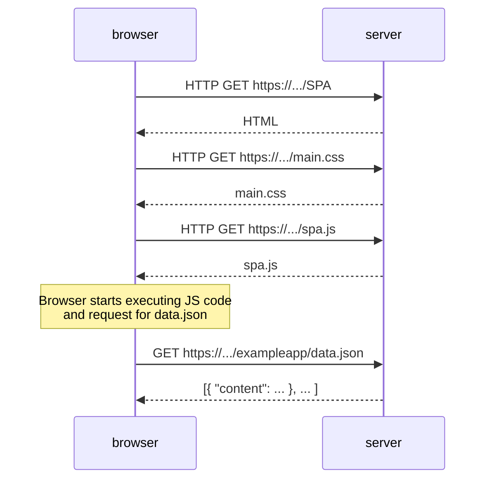

```mermaid
sequenceDiagram
    participant browser
    participant server

    browser->>server: HTTP GET https://.../SPA
    server-->>browser: HTML

    browser->>server: HTTP GET https://.../main.css
    server-->>browser: main.css

    browser->>server: HTTP GET https://.../spa.js
    server-->>browser: spa.js
   
    note over browser: Browser starts executing JS code<br/> and request for data.json

    browser->>server: GET https://.../exampleapp/data.json
    server-->>browser: [{ "content": ... }, ... ]

```
